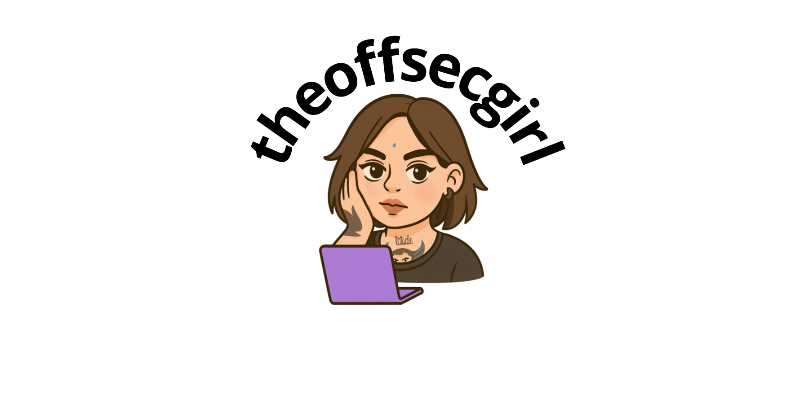

  

  Seguridad ofensiva • Hacking • Desarrollo de herramientas • Formación profesional

---

## Sobre mí

Soy profesional de seguridad ofensiva, formadora técnica y creadora de herramientas.  
Trabajo en bug bounty, desarrollo herramientas reales para automatizar fases ofensivas  
y dirijo Northstar Academy, donde formo a estudiantes y profesionales  
en hacking ético con un enfoque claro, directo y sin artificios.

Mi trabajo se centra en tres pilares:

1. **Análisis ofensivo real**  
2. **Desarrollo de tooling propio**  
3. **Formación práctica y rigurosa**

---

## Herramientas que desarrollo

Repositorios principales:

- **tool-takeovflow** – Subdomain Takeover Scanner  
- **tool-bluedeath** – Auditoría Bluetooth BR/EDR  
- **tool-waxss** – XSS & WAF testing tool  
- **tool-lfdscanner** – Local File Disclosure & Traversal  
- **tool-webflow** – Web Recon Scanner  
- **poc-cors-toolkit** – Auditoría de CORS en aplicaciones web  

Cada herramienta sigue una misma filosofía:  
precisión, simplicidad, utilidad real y documentación clara.

---

## Northstar Academy

Plataforma de formación en seguridad ofensiva:  
lenguaje directo, método sólido y práctica continua.  
Contenido diseñado para aprender haciendo, sin ruido y sin humo.

**👉🏻 https://www.northstaracademy.io**

Cursos impartidos:

- Fundamentos de Seguridad Ofensiva  
- Reconocimiento (Recon)  
- Redes y arquitectura segura  
- Laboratorios y PoCs ofensivas

---

## Áreas técnicas

- Seguridad ofensiva y bug bounty  
- Reconocimiento, automatización y tooling  
- Python, Bash, PowerShell  
- Auditoría web (XSS, SQLi, LFI/RFI, CSRF, etc.)  
- Nmap, ffuf, nuclei, Burp Suite  
- Linux y macOS para entornos ofensivos  

---

## Contacto

- Web personal: **https://www.theoffsecgirl.com**  
- Academia: **https://www.northstaracademy.io**  
- LinkedIn: **https://www.linkedin.com/in/theoffsecgirl**

